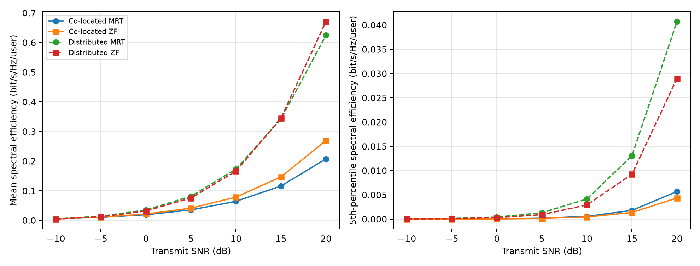
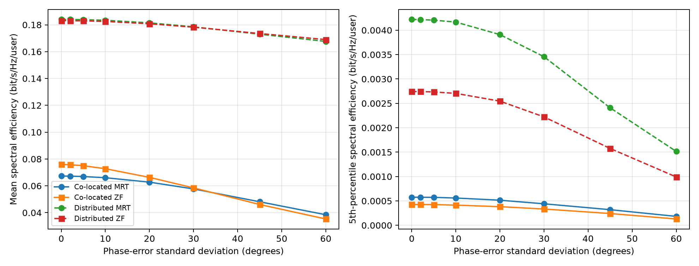

# Distributed MIMO Performance and Synchronization Study

A reproducible Python simulation for comparing **co-located** and
**distributed** multi-user MIMO downlinks under realistic propagation and
phase-synchronization errors.

The project uses Monte Carlo experiments to study how antenna placement and
precoding affect average-user performance, cell-edge performance, and energy
efficiency. It supports maximum-ratio transmission (MRT) and zero-forcing (ZF)
precoding.

## Highlights

- Compares equal-size co-located and distributed antenna deployments
- Implements MRT and ZF downlink precoding
- Models distance-dependent path loss and log-normal shadowing
- Includes Rayleigh small-scale fading
- Simulates independent phase errors across transmit antennas
- Measures mean and 5th-percentile spectral efficiency
- Estimates energy efficiency using transmit, RF-chain, site, and fronthaul
  power
- Exports publication-ready plots and tidy CSV summaries
- Provides deterministic experiments through configurable random seeds
- Includes automated tests for important model properties

## Results

### Spectral efficiency versus SNR



### Sensitivity to phase errors



With the default configuration and random seed, distributed MRT achieved a
mean spectral efficiency of approximately **0.173 bit/s/Hz/user at 10 dB**,
compared with **0.064 bit/s/Hz/user** for co-located MRT. Its 5th-percentile
spectral efficiency was approximately **7.3 times higher**. These values are
illustrative simulation outputs, not universal deployment benchmarks; they
depend on the propagation, topology, power, and hardware assumptions in
`configs/baseline.toml`.

## System model

The simulation considers a narrowband downlink with `M` transmit antennas and
`K` single-antenna users. Both deployments use the same total number of
antennas:

- **Co-located MIMO:** all antennas are placed at the center of the coverage
  area.
- **Distributed MIMO:** antennas are distributed uniformly throughout the
  coverage area.

For channel matrix `H`, precoder `W`, and diagonal phase-error matrix
`D_phi`, the effective downlink channel is

```text
G = H D_phi W
```

The total transmit power is divided equally among users. The SINR of user `k`
is

```text
SINR_k = (P/K) |G_kk|²
         ---------------------------------------
         noise + (P/K) sum_{j != k} |G_kj|²
```

Spectral efficiency is then calculated as

```text
SE_k = log2(1 + SINR_k).
```

The simulation uses wrapped distances to reduce artificial boundary effects
in the finite square coverage area. MRT and ZF are evaluated on the same
topology and channel realization for a fair comparison.

## Requirements

- Python 3.10 or newer
- NumPy
- Matplotlib
- pytest, for running the test suite

The required packages are declared in `pyproject.toml`.

## Installation

Clone or download the repository, open a terminal in its root directory, and
create a virtual environment:

```bash
python3 -m venv .venv
source .venv/bin/activate
python -m pip install --upgrade pip
python -m pip install -e ".[dev]"
```

On Windows PowerShell, activate the environment with:

```powershell
.venv\Scripts\Activate.ps1
```

## Running the experiments

Run the complete study:

```bash
mimo-study all --config configs/baseline.toml
```

Run only the SNR sweep:

```bash
mimo-study baseline --config configs/baseline.toml
```

Run only the phase-error sensitivity experiment:

```bash
mimo-study phase --config configs/baseline.toml
```

Choose a different output directory:

```bash
mimo-study all \
  --config configs/baseline.toml \
  --output path/to/results
```

The package can also be run without its installed command-line entry point:

```bash
PYTHONPATH=src python -m distributed_mimo all \
  --config configs/baseline.toml
```

## Configuration

The main experiment settings are in `configs/baseline.toml`:

```toml
[simulation]
seed = 42
realizations = 200
area_side_m = 500.0
num_antennas = 32
num_users = 8
snr_db = [-10.0, -5.0, 0.0, 5.0, 10.0, 15.0, 20.0]
phase_std_deg = [0.0, 2.0, 5.0, 10.0, 20.0, 30.0, 45.0, 60.0]
phase_study_snr_db = 10.0
```

The same file also exposes channel and power-model parameters. Increasing
`realizations` generally produces smoother estimates but increases execution
time. The number of antennas must be at least the number of users for ZF.

## Generated files

Experiments write the following files to `results/`:

```text
results/
├── baseline_spectral_efficiency.png
├── baseline_spectral_efficiency_summary.csv
├── phase_sensitivity.png
└── phase_sensitivity_summary.csv
```

Each CSV contains the deployment, precoder, sweep value, mean spectral
efficiency, 5th-percentile spectral efficiency, and energy efficiency in
bit/Joule.

## Repository structure

```text
.
├── configs/
│   └── baseline.toml
├── results/
├── src/
│   └── distributed_mimo/
│       ├── channel.py       # Large- and small-scale channel models
│       ├── cli.py           # Command-line interface
│       ├── config.py        # Typed configuration objects
│       ├── metrics.py       # Spectral- and energy-efficiency metrics
│       ├── precoding.py     # MRT and ZF precoders
│       ├── simulation.py    # Monte Carlo experiment engine
│       └── topology.py      # User and antenna placement
├── tests/
│   └── test_model.py
├── pyproject.toml
└── README.md
```

## Testing

Run the test suite from the repository root:

```bash
pytest
```

The tests verify wrapped distance calculations, ZF interference cancellation,
phase-error degradation, and invalid ZF dimension handling.

## Current assumptions

- Narrowband flat-fading channel
- Perfect channel-state information when constructing the precoder
- Single-antenna users
- Equal transmit-power allocation across users
- Independent log-normal shadowing across antenna-user links
- Independent antenna phase offsets
- Phase drift occurs after precoder construction
- Simplified configurable hardware power model

These assumptions make the baseline easy to reproduce and extend. They should
be stated when presenting or interpreting the results.

## Possible extensions

- OFDM timing and carrier-frequency offset models
- Imperfect or delayed channel-state information
- One oscillator process per distributed access point
- Spatially correlated fading and shadowing
- User-centric access-point clustering
- Access-point selection and power control
- Confidence intervals across Monte Carlo realizations
- MATLAB implementation and cross-language verification

## License

No license has been selected yet. Add a `LICENSE` file before distributing or
accepting external contributions.
