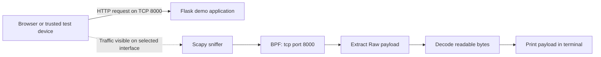

# Packet Sniffer


An educational packet-sniffing lab built with Python, Flask, and Scapy on macOS. The project demonstrates why sensitive information should never be sent over unencrypted HTTP: a packet sniffer monitoring the correct network interface can inspect readable form data as it travels across the network.

> [!CAUTION]
> Use this project only in a controlled lab, on systems and networks that you own or have explicit permission to test. Never enter or collect real passwords, payment details, or other sensitive information. Unauthorized packet capture may violate privacy, organizational policy, or applicable law.

## Table of contents

- [Overview](#overview)
- [How it works](#how-it-works)
- [Features](#features)
- [Project structure](#project-structure)
- [Requirements](#requirements)
- [Installation](#installation)
- [Network interface configuration](#network-interface-configuration)
- [Running the lab](#running-the-lab)
- [Expected behavior](#expected-behavior)
- [Demo applications](#demo-applications)
- [macOS notes](#macos-notes)
- [Troubleshooting](#troubleshooting)
- [Security considerations](#security-considerations)
- [Limitations](#limitations)
- [Possible improvements](#possible-improvements)
- [Acknowledgements](#acknowledgements)
- [License](#license)

## Overview

This project contains two small Flask applications and a Scapy-based packet sniffer:

1. A Flask server hosts a simulated hotel Wi-Fi login page on TCP port `8000`.
2. A browser submits test form data to the server over plaintext HTTP.
3. Scapy monitors the selected macOS network interface.
4. A Berkeley Packet Filter (BPF) limits capture to TCP traffic on port `8000`.
5. Raw TCP payloads are decoded and printed to the terminal when readable.

The lab illustrates a core network-security principle: **HTTP does not provide confidentiality**. Anyone with legitimate access to capture the relevant traffic may be able to read its contents. HTTPS protects against this by encrypting application data in transit.

This implementation was developed on macOS. It does **not** use Npcap, which is a Windows packet-capture driver. Scapy uses the packet-capture facilities available on macOS instead.

## How it works



The sniffer uses the following Scapy call:

```python
sniff(
    iface="en0",
    filter="tcp port 8000",
    prn=catch_packets,
    store=False,
)
```

- `iface="en0"` selects the interface to monitor.
- `filter="tcp port 8000"` applies a BPF capture filter before packets reach the callback.
- `prn=catch_packets` sends each captured packet to the payload handler.
- `store=False` avoids retaining captured packets in memory.

For packets containing Scapy's `Raw` layer, the callback decodes the payload with invalid byte sequences ignored. Payloads longer than ten characters are printed to reduce very small or incomplete fragments in the output.

## Features

- Captures live TCP traffic with Scapy.
- Uses a BPF filter to focus on port `8000`.
- Extracts and decodes readable raw payload data.
- Includes a responsive HTML interface shared by both Flask demos.
- Provides a basic login page for illustrating plaintext form submission.
- Includes an alternate, intentionally untrusted portal simulation for security-awareness demonstrations.
- Runs on macOS without Npcap.
- Avoids storing captured packets in application memory.

## Project structure

```text
packet-sniffer/
├── app.py       # Basic Flask login demo
├── mal_app.py   # Intentionally deceptive portal simulation
├── sniffer.py   # Scapy packet-capture logic
└── ui.py        # Shared responsive HTML and CSS wrapper
```

| File | Purpose |
| --- | --- |
| `app.py` | Serves the basic hotel Wi-Fi login page and handles the `/login` form submission. The server displays the submitted username but does not retain the password. |
| `mal_app.py` | Models an untrusted captive portal that requests additional payment details. Its `/pay` route displays a confirmation and does not store the submitted fields. Use dummy data only. |
| `sniffer.py` | Captures TCP traffic on port `8000`, extracts Scapy `Raw` payloads, decodes readable content, and prints it. |
| `ui.py` | Supplies the shared card layout, responsive form styling, colors, and status presentation. |

## Requirements

- macOS
- Anaconda or Miniconda
- Python 3 in a Conda environment
- Administrator privileges for live packet capture
- A network interface that can observe the test traffic
- A private, controlled network or a loopback-only test setup

Python dependencies:

- [Flask](https://flask.palletsprojects.com/) — hosts the demonstration web application
- [Scapy](https://scapy.readthedocs.io/) — captures and parses network packets

### Why Npcap is not required

Npcap is intended for Windows. This project was created and tested for macOS, where Scapy can use the operating system's native packet-capture support. No Npcap installation or Windows compatibility mode is needed.

## Installation

Clone the repository:

```bash
git clone https://github.com/kumarprat1996/packet-sniffer.git
cd packet-sniffer
```

Create and activate a Conda environment:

```bash
conda create --name packet-sniffer python=3
conda activate packet-sniffer
```

Install the dependencies from `conda-forge`:

```bash
conda install --channel conda-forge flask scapy
```

To leave the Conda environment later:

```bash
conda deactivate
```

## Network interface configuration

The current sniffer is configured to capture from `en0`:

```python
sniff(iface="en0", filter="tcp port 8000", prn=catch_packets, store=False)
```

`en0` is commonly the Wi-Fi interface on a Mac, but the name can vary by device and configuration.

### Find the Wi-Fi interface

List macOS hardware ports:

```bash
networksetup -listallhardwareports
```

Look for the `Hardware Port: Wi-Fi` entry and note its `Device` value.

You can also list interfaces recognized by Scapy:

```bash
python -c "from scapy.all import get_if_list; print('\n'.join(get_if_list()))"
```

If Wi-Fi uses a different device, such as `en1`, update the `iface` value in `sniffer.py`.

### Loopback testing

Traffic sent to `127.0.0.1` normally travels over the loopback interface rather than Wi-Fi. To run the entire lab on one Mac:

1. Change `iface="en0"` to `iface="lo0"` in `sniffer.py`.
2. Bind the Flask test application to `127.0.0.1` instead of `0.0.0.0`.
3. Open `http://127.0.0.1:8000`.

This loopback-only configuration is the safest way to experiment because the demo is not exposed to other devices.

## Running the lab

Use separate Terminal windows for the Flask server and packet sniffer.

### 1. Start the basic Flask application

In the first Terminal:

```bash
conda activate packet-sniffer
python app.py
```

The server listens on port `8000`. With the current source configuration, it binds to all local interfaces:

```text
http://127.0.0.1:8000
```

### 2. Start the packet sniffer

In the second Terminal:

```bash
sudo "$CONDA_PREFIX/bin/python" sniffer.py
```

Enter your macOS administrator password if prompted. Password entry is not displayed in Terminal.

`$CONDA_PREFIX` points to the active Conda environment. Passing its complete Python path to `sudo` ensures that the privileged process uses the environment where Scapy is installed.

### 3. Generate test traffic

Choose the test URL based on the interface being monitored:

- For `lo0`, open `http://127.0.0.1:8000` on the same Mac.
- For `en0`, use a trusted test device on the same private network and open `http://<mac-lan-ip>:8000`.

Find the Mac's Wi-Fi address with:

```bash
ipconfig getifaddr en0
```

Replace `en0` if your Wi-Fi interface has a different name.

Submit **dummy credentials only**, for example:

```text
Username: lab-user
Password: demo-only
```

Stop either process with `Control+C`.

> [!IMPORTANT]
> The existing Flask configuration uses `host="0.0.0.0"` and `debug=True`. Run it only on a trusted, isolated network. For ordinary local testing, change the host to `127.0.0.1`.

## Expected behavior

When the sniffer starts, it displays:

```text
Starting packet sniffer...
```

After the browser submits the login form over HTTP, the sniffer may print an HTTP request, headers, or a form body similar to:

```text
username=lab-user&password=demo-only
```

The exact output varies because TCP can divide application data across multiple packets. Small fragments and packets without a Scapy `Raw` layer are ignored by the current callback.

The browser then receives a confirmation page similar to:

```text
Successfully logged in as: lab-user
```

## Demo applications

### Basic login demo

Run:

```bash
python app.py
```

Routes:

| Method | Route | Behavior |
| --- | --- | --- |
| `GET` | `/` | Displays the simulated hotel Wi-Fi login form. |
| `POST` | `/login` | Reads the submitted username and displays a success message. |

The form is intentionally sent over HTTP so the lab can demonstrate the absence of transport encryption.

### Untrusted portal simulation

`mal_app.py` is an intentionally unsafe security-awareness example. It demonstrates how a deceptive captive portal may request more information after an initial login.

Routes:

| Method | Route | Behavior |
| --- | --- | --- |
| `GET` | `/` | Displays the simulated free Wi-Fi login form. |
| `POST` | `/login` | Displays a fake high-speed Wi-Fi upgrade form. |
| `POST` | `/pay` | Displays a simulated payment confirmation. |

This module must never be deployed publicly or used to request real information. If it is examined interactively, keep it on loopback, use invented values, and stop the server immediately after the lab.

## macOS notes

### Capture permissions

Opening a live capture interface normally requires elevated privileges on macOS. Run only the sniffer with `sudo`; the Flask application does not need administrator access.

### macOS firewall prompt

The first time Python accepts incoming network connections, macOS may display a firewall prompt. Only allow incoming connections when you intend to test from another trusted device. Loopback testing does not require exposing the service to the local network.

### Apple Silicon

The project is pure Python and does not contain architecture-specific source code. Use a Python distribution and Scapy installation compatible with your Mac.

### Port consistency

The Flask applications and capture filter currently use port `8000`. If you change the Flask port, update the BPF filter in `sniffer.py` to match:

```python
filter="tcp port <new-port>"
```

## Troubleshooting

### `PermissionError` or capture access denied

Live capture usually requires administrator privileges:

```bash
conda activate packet-sniffer
sudo "$CONDA_PREFIX/bin/python" sniffer.py
```

### `ModuleNotFoundError: No module named 'scapy'`

Install Scapy in the active environment:

```bash
conda activate packet-sniffer
conda install --channel conda-forge scapy
```

When using `sudo`, call the active environment's Python through `$CONDA_PREFIX/bin/python` rather than relying on the shell to resolve `python`.

### `ModuleNotFoundError: No module named 'flask'`

```bash
conda activate packet-sniffer
conda install --channel conda-forge flask
```

### Interface `en0` cannot be found

Identify the correct device:

```bash
networksetup -listallhardwareports
```

Then update `iface` in `sniffer.py`.

### The page opens, but the sniffer prints nothing

Check all of the following:

- The sniffer is running with sufficient privileges.
- The selected interface carries the browser's traffic.
- The Flask application and BPF filter both use port `8000`.
- The URL begins with `http://`, not `https://`.
- Loopback traffic is captured on `lo0`, not `en0`.
- A remote test device is using the Mac's correct LAN IP address.
- macOS Firewall is not blocking the intended lab connection.

### `Address already in use`

Another process is already listening on port `8000`. Find it with:

```bash
lsof -nP -iTCP:8000 -sTCP:LISTEN
```

Stop the process if it belongs to you, or change the port in both the Flask application and the sniffer filter.

### Output is partial or difficult to read

TCP is a byte stream and may split one HTTP request across multiple packets. The current project does not perform TCP stream reassembly, so partial output is expected.

## Security considerations

This code is intentionally insecure because it exists to demonstrate security risks.

- Form data is transmitted over plaintext HTTP.
- The Flask development server runs with debug mode enabled.
- The server binds to every local interface by default.
- Captured payloads are printed in plaintext to the terminal.
- Submitted usernames are inserted directly into generated HTML.
- The alternate portal imitates a deceptive payment request.
- There is no authentication, encryption, rate limiting, input validation, or production hardening.

Do not use this application as a real login portal, captive portal, payment page, monitoring service, or production server.

For real applications:

- Use HTTPS for all traffic.
- Never collect payment information without an appropriate, compliant payment provider.
- Escape and validate untrusted input.
- Disable Flask debug mode.
- Bind development services to loopback unless remote access is explicitly required.
- Minimize captured data and follow applicable privacy and retention requirements.

## Limitations

- The interface name is hard-coded.
- The capture port is hard-coded.
- Only packets containing a Scapy `Raw` layer are printed.
- The sniffer does not reassemble TCP streams.
- The sniffer does not reconstruct HTTP requests or responses.
- Encrypted HTTPS payloads cannot be read as plaintext.
- IPv4/IPv6 metadata and protocol summaries are not displayed.
- Captures cannot currently be saved to or loaded from a PCAP file.
- There is no command-line argument handling.
- There are no automated tests or dependency lock files.
- The Flask development server is not suitable for production.

## Possible improvements

- Add command-line options for the interface, port, and BPF filter.
- Detect available interfaces and prompt the user to choose one.
- Default the demonstration to loopback for safer local use.
- Add structured packet summaries for Ethernet, IP, TCP, and UDP layers.
- Implement TCP stream reassembly for clearer application-level output.
- Add optional PCAP export for later analysis in Wireshark.
- Replace `print` statements with configurable logging.
- Add a `requirements.txt` or `pyproject.toml`.
- Add unit tests for payload decoding and Flask routes.
- Escape all displayed form input.
- Disable debug mode by default.
- Add an explicit consent screen and dummy-data validation for classroom use.

## Acknowledgements

This project was inspired by [MariyaSha/PacketSniffer](https://github.com/MariyaSha/PacketSniffer) and recreated for macOS using Python, Flask, and Scapy. Unlike a Windows-based setup, this version does not rely on Npcap.

## License

This repository does not currently include a license file. Until a license is added, the source remains under the copyright terms that apply by default. Add a license before inviting reuse or redistribution.
